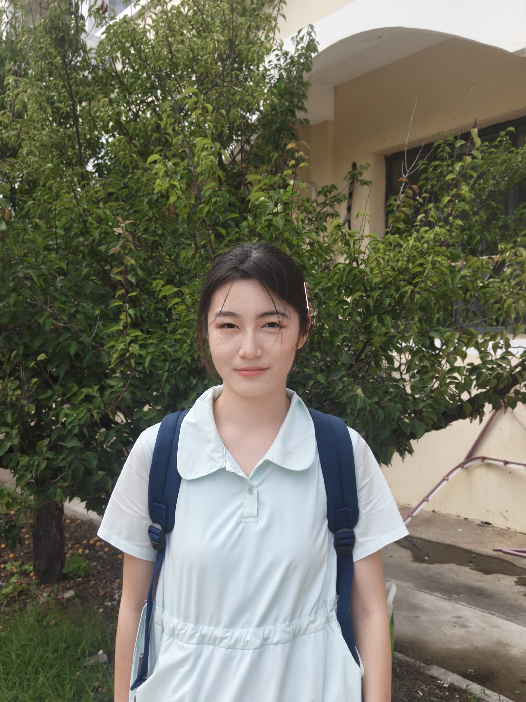

# 🍂 Autumn Comic（秋日漫画）

Transform your photos into warm, cozy autumn comic-style illustrations with ChatGPT.

**Autumn Comic** is an open-source ChatGPT Skill for image style transformation.

Upload an image, and the Skill will transform it into a warm autumn comic illustration while preserving the original subject and composition as much as possible.

## ✨ Features

- 🍁 Warm autumn comic illustration style
- 👤 Preserves character identity and facial features
- 💇 Preserves hairstyle and clothing
- 🧍 Preserves pose and number of people
- 🖼️ Preserves the original composition
- ☀️ Adds soft autumn afternoon sunlight
- 🍂 Adds natural autumn leaves and foliage
- 🎨 Creates a true illustrated look instead of a simple color filter

## 🚀 Usage

After installing the Skill, upload an image to ChatGPT and say:

> 请将我上传的图片转换为秋日漫画风，保留人物和原有构图。

Or:

> Convert this image into an autumn comic style.

The Skill will use the uploaded image as the primary visual reference and transform it into an autumn-themed comic illustration.

## 📦 Project Structure

```text
autumn-comic/
├── plugin.json
├── skills/
│   └── autumn-comic/
│       └── SKILL.md
├── examples/
│   ├── original.jpg
│   └── autumn-comic.png
├── README.md
└── LICENSE
```

## 🖼️ Example

<table>
  <tr>
    <th>Original</th>
    <th>Autumn Comic</th>
  </tr>
  <tr>
    <td width="50%">
      
    </td>
    <td width="50%">
      
    </td>
  </tr>
</table>
